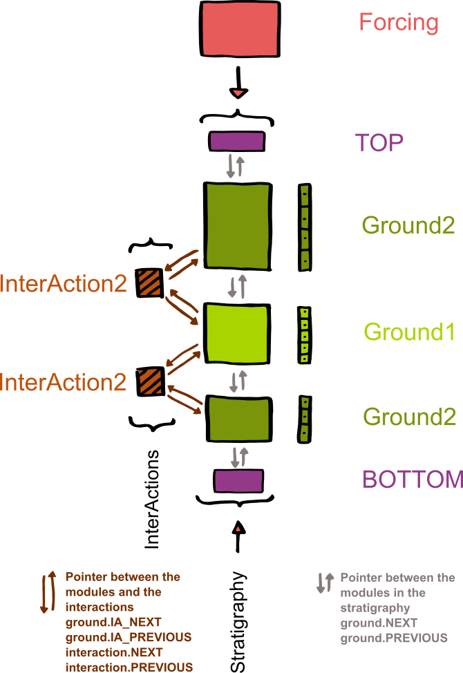
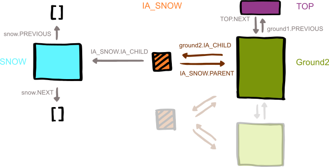
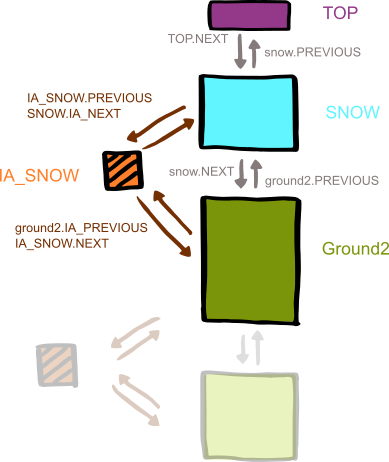

Cryogrid (julia version)
============

CryoGrid is a numerical model, to calculate temperature evolution in 1D stratigraphies. 

This Documentation
-------------------
1. Structure of the Model and Terminology
2. Style Guide
3. Mandatory Variables and Functions

**Terminology**

+ *CryoGrid strata*: Element of the stratigraphy (i.e. ground, lake, vegetation, snow, etc.). Mutable struct with mandatory functions and properties which contains the defining equations for the time evolution of the stratum element. 
+ *CryoGrid stratigraphy*: stratigraphy of connected CryoGrid strata.

**Folder structure**

- *main.m*: main file to be executed
- **Results**: contains the saved output files 
- **ForcingData**: contains the forcing data as *.mat*-files. 
- **StrataModules**: contains the code for the strata elements
- **ForcingModules**: contains the code for the forcing classes which make forcing data accessible for the CryoGrid strata
- **Common**: contains modules for initialization, as well as functions that could be used by classes at all levels in the class hierarchy

**Basic Structure of the Soil Column**

A model run needs a forcing module, the special TOP and BOTTOM modules and one (or more) strata elementsnto build the stratigraphy of the 1D (soil-) column that is being modelled. The stacked ground (or snow) modules are linked with pointers *stratum.NEXT* and *stratum.PREVIOUS*. Interaction (e.g. exchange of heat, salt, water) between modules happens with interaction classes. Again the connection is realised with pointers *stratum.IA_NEXT* and *stratum.IA_PREVIOUS* from the ground modules to the interaction and *interaction.NEXT* and *interaction.PREVIOUS* from the interaction to the ground modules. In this way the interaction has direct access to both involved ground modules.

A strata element can delete itself, move itself to a new position, or initialize and insert a new module (from the same or different classes). This can be used for snow buildup and melt, sedimentation, erosion, ice lenses, lakes.... Here is a short example with snow to illustrate the process.

The uppermost strata element builds a child and connects to it with a interaction. The interaction initializes the child with empty pointers. In the next timesteps, the child gets filled up to a certain threshold (e.g. a certain snow water equivalent). Once this threshold is reached, i.e. the amount of snow is enough to justify a new module, the child gets inserted above the parent as the new top module and all pointers get relocated.

Style Guide
--------------
**Compatibility**

All modules can handle whichever state variable they need and use whichever boundary conditions. However, the boundary conditions need to be compatible with the used interaction class(es) and the used forcing. For example, if you have the temperature as a state variable and the interaction between two modules is handled as a heat flow, then your boundary conditions need to convert the forcing data into heat flows at the upper and lower boundaries.

**General Remarks**

- Use meaningful names: Use short phrases for clarity rather than abbreviations for shortness.
- Physical properties should be named by their SI symbols.
- In functions, used variables from containers should be saved by their name, i.e. *theta = stratum.CONST.theta*
- Variables and functions should be in lower case. Variable word separation may be indicated with camel case, word separation in function names with underscores.
- If you use equations and constants, cite their source in comments.

**Documentation**

Every author is responsible for the documentation of his*her own module. 

Mandatory Functions and Variables
----------------------------------

The structures for the variables are defined in *Common/CryoGridTypes.jl*

**Strata Element**

The definition of a new module should look like follows. The functions are mandatory for the time loop to work. The "initialize" function may take additional input parameters, as you only use it before entering the time loop, the other functions may not.

*stratum.CONST* constants 
*stratum.PARA* parameter
*stratum.STATVAR* state variables
*stratum.TEMP* temporary needed variables, to be calculated in the appropriate functions (*get_boundary_condition_***, *get_derivatives_prognostic*, interactions, etc.) - depends on choice of state variables - needed boundary conditions depend also on the chosen interaction

*stratum.PREVIOUS*
*stratum.NEXT*
*stratum.IA_PREVIOUS*
*stratum.IA_NEXT*

*initialize_from_file(stratum)*
*initialize_STATVAR(ground, grid, forcing)*
*get_boundary_condition_u(ground, forcing)*
*get_boundary_condition_l(ground)*
*get_derivatives_prognostic(ground)*
*get_timestep(ground)*
*advance_prognostic(ground, timestep)*
*compute_diagnostic_first_cell(ground, forcing)*
*compute_diagnostic(ground, forcing)*

**Forcing**

A new forcing module loads or generates forcing data. The state variables that are provided by the forcing module need to match the ones that are needed by the used ground modules.

*forcing.PARA* parameter of the forcing class
*forcing.DATA* data of the forcing, to be calculated in *generateForcing*, all variable are vectors with the same length
*forcing.TEMP* temporary variables, to be calculated in *interpolateForcing*, depending on the choice of state variables, all variables are single values interpolated for each time step

*initalize_from_file(forcing, section)*
*load_forcing_from_mat(forcing)*
*interpolate_forcing(t, forcing)*

**Interaction**

The interaction classes handle the boundary conditions for all modules in the stratigraphy that share an *inner boundary* with another module. The interaction has pointers to the two interacting modules and can therefore change both modules directly. The interaction needs to match the boundary conditions that are used in the modules. 

*interaction.PREVIOUS*
*interaction.NEXT*

*get_boundary_condition_m(ia_heat)*

